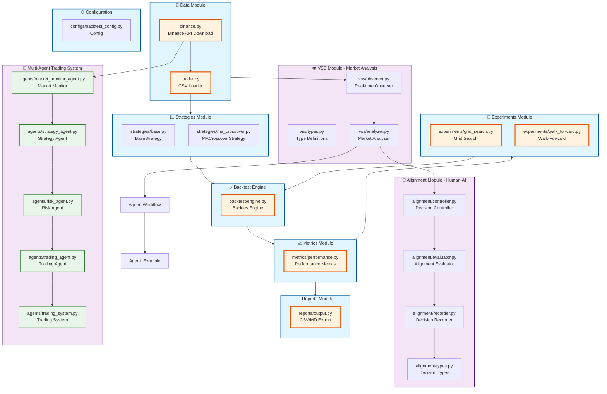
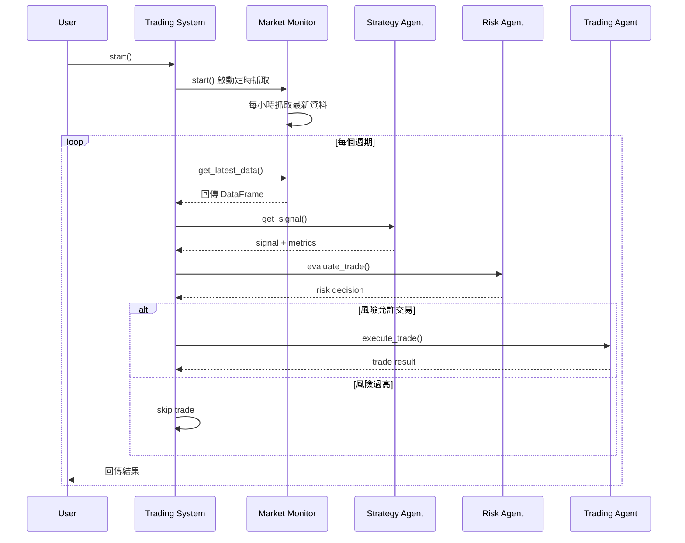
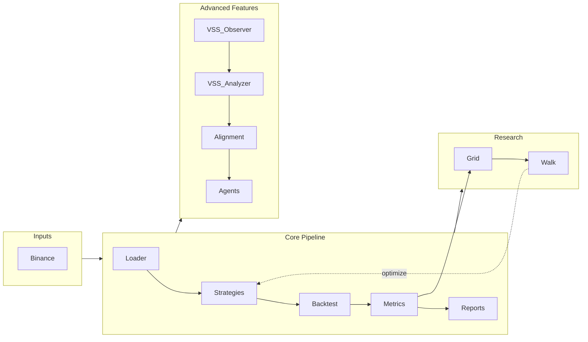
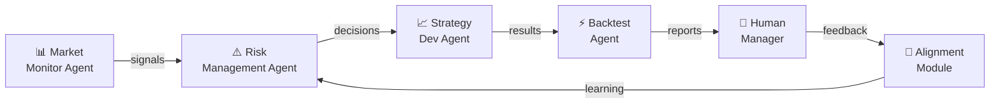
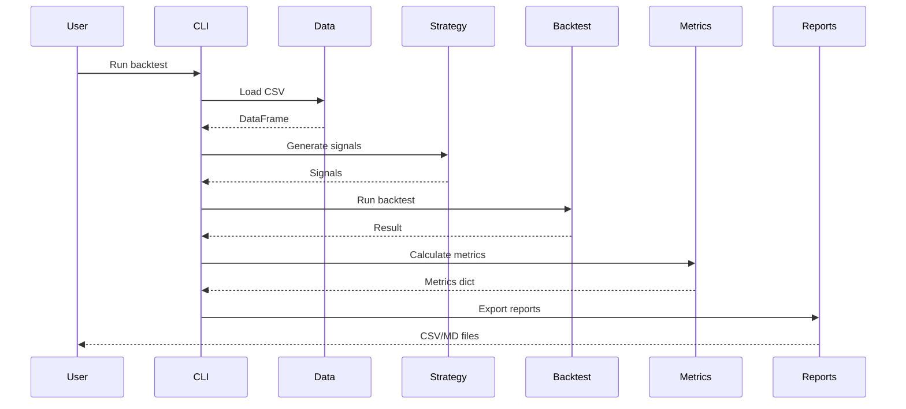

# Crypto Backtester - Project Architecture

## Multi-Agent Trading Flow

## Agent Responsibilities

| Agent | 職責 | 輸入 | 輸出 |
|-------|------|------|------|
| **Market Monitor** | 定時抓取資料 | Binance API | CSV/DB |
| **Strategy** | 產生訊號 | 歷史資料 | buy/sell/hold |
| **Risk** | 風險評估 | 訊號+市場資料 | 執行決定 |
| **Trading** | 執行交易 | 風險決定 | 訂單結果 |
| **System** | 協調所有 Agent | - | 完整流程 |

## Module Dependencies

## Agent Workflow

## Data Flow

