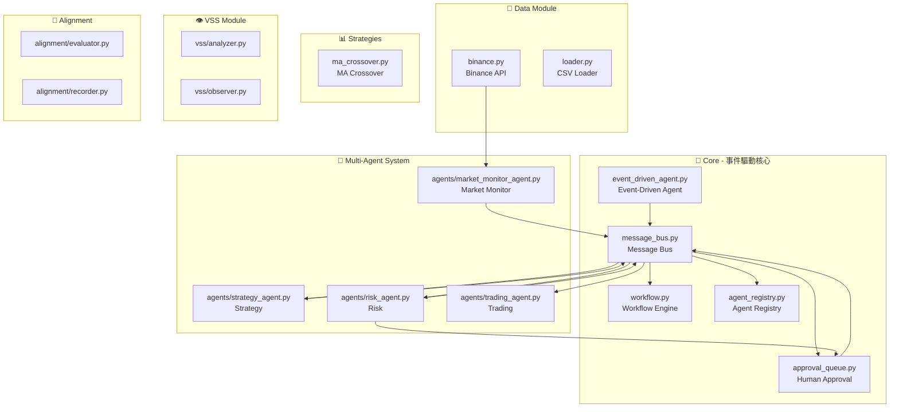
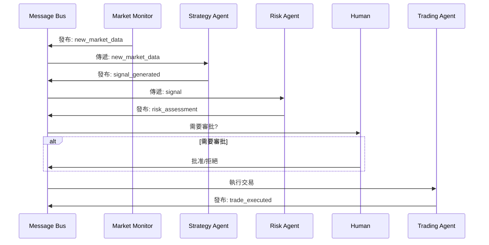
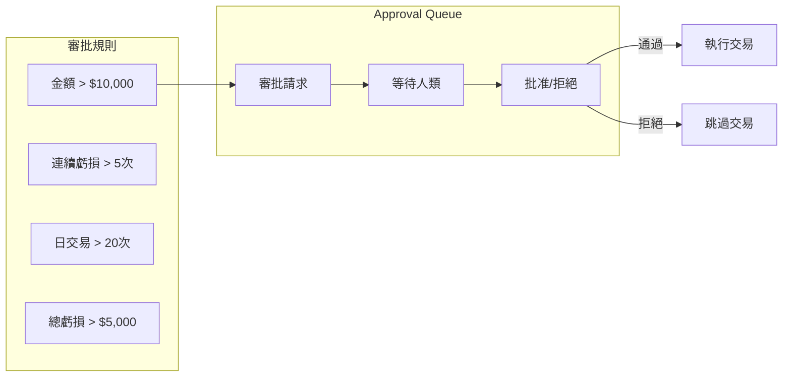
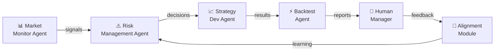
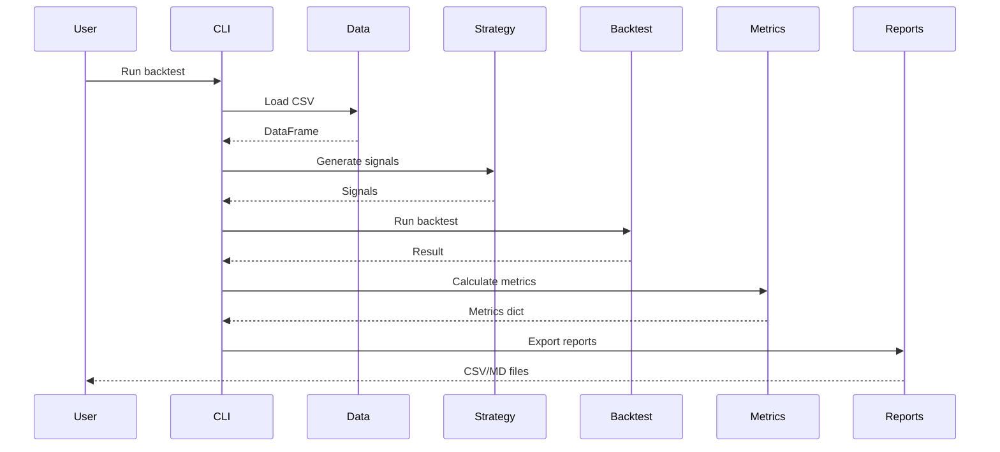

# Crypto Backtester - Project Architecture

## 系統架構總覽



## Event-Driven Flow



## Human-in-the-Loop



## 動態 Workflow 配置

```yaml
# workflow.yaml
name: trading_workflow
entry_point: market_monitor

nodes:
  - name: market_monitor
    agent_type: market_monitor
    actions:
      - type: publish
        event: new_market_data
    
  - name: strategy
    agent_type: strategy
    actions:
      - type: publish
        event: signal_generated
    
  - name: risk_check
    agent_type: risk
    conditions:
      - type: gt
        field: amount
        value: 10000
    actions:
      - type: approval
        threshold: 10000
```

## 功能對照表

| 模組 | 功能 | 實現 |
|------|------|------|
| Message Bus | 事件發布/訂閱 | `core/message_bus.py` |
| Workflow | 動態流程配置 | `core/workflow.py` |
| Approval Queue | 人類審批 | `core/approval_queue.py` |
| Agent Registry | Agent 註冊發現 | `core/agent_registry.py` |
| Event-Driven Agent | Agent 基底類別 | `core/event_driven_agent.py` |

## Agent Workflow



## Data Flow


